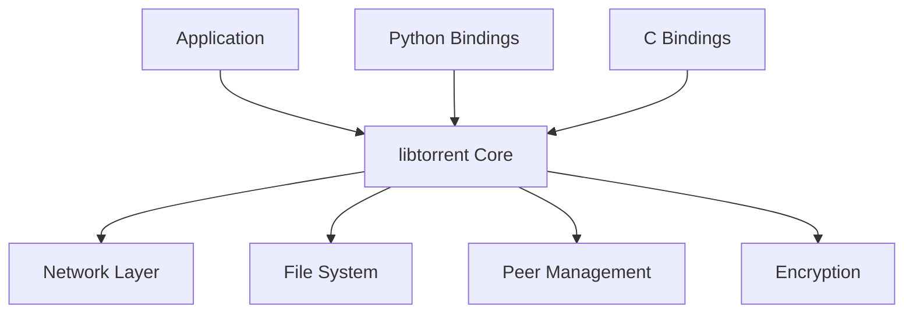

# Getting Started with libtorrent

## Main Purpose

libtorrent is a powerful C++ library designed to implement BitTorrent protocol clients. It enables developers to build efficient, cross-platform torrent applications that can download and share files using peer-to-peer networking. The project solves the challenges of reliable file sharing across networks by providing:

- High-performance torrent downloading
- Bandwidth management
- Peer discovery and connection handling
- File integrity verification through hashing

This library powers many popular torrent clients and is widely used in both open-source and commercial applications.

## Core Architecture

The libtorrent library consists of several key components:

- **Core Library**: The main implementation of BitTorrent protocol (in `libtorrent/` directory)
- **Bindings**: Language interfaces for C and Python
- **Examples**: Practical usage demonstrations
- **Utilities**: Helper functions and data structures



## Getting Started

### Where to Begin

New developers should start with these key files:

1. **`libtorrent.h`** - The main header file defining the public API
2. **`library.cpp`** - C bindings implementation
3. **`bt-get.cpp`** - Simple example of downloading a torrent

### Important Files to Understand

- `session.hpp` and `session.cpp` - Main session management class
- `torrent_handle.hpp` and `torrent_handle.cpp` - Handle for individual torrents
- `alert.hpp` and `alert.cpp` - Event notification system

### Common Workflows

```cpp
#include "libtorrent.h"

// Create a torrent session
lt::session ses;

// Add a torrent to download
lt::add_torrent_params params;
params.ti = lt::create_torrent();
params.save_path = "./downloads";
ses.add_torrent(params);

// Process alerts and events
while (true) {
    lt::alert const* a = ses.wait_for_alert(lt::seconds(5));
    if (a) {
        // Handle alert
        std::cout << a->msg() << std::endl;
    }
}
```

## Technology Stack

- **C++ Standard**: C++14 (with some C++17 features)
- **Key Libraries**: Boost, OpenSSL, zlib
- **Build System**: CMake
- **Testing Framework**: Google Test

For more details, see the [main header file](libtorrent/libtorrent.h) and [example code](examples/bt-get.cpp).