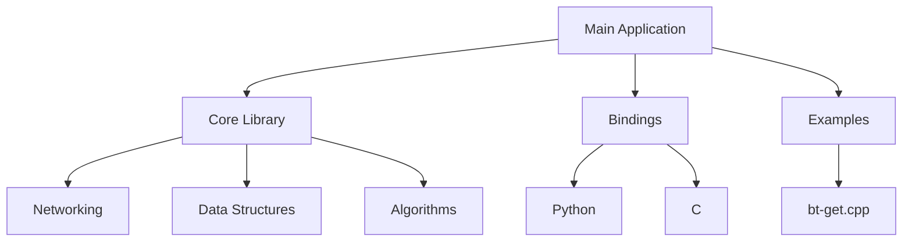

# Getting Started with libtorrent

## Main Purpose

Libtorrent is a high-performance C++ library designed for implementing BitTorrent clients. It solves the challenge of efficiently downloading and uploading files using the BitTorrent protocol across various platforms. This library powers applications like qBittorrent, Deluge, and other torrent clients, enabling peer-to-peer file sharing with support for advanced features like encryption, bandwidth limiting, and magnet links.

## Core Architecture

The project consists of several key components:

- **Core Library**: The heart of the project, implementing BitTorrent protocol specifications (e.g., `session.cpp`, `torrent.cpp`)
- **Bindings**: Language interfaces for Python and C (e.g., `libtorrent.h`, `boost_python.hpp`)
- **Examples**: Practical demonstrations of library usage (e.g., `bt-get.cpp`)
- **Utilities**: Helper modules for common tasks (e.g., `create_torrent.cpp`, `alert.cpp`)
- **Networking**: TCP/UDP implementations and peer communication (e.g., `tcp_socket.cpp`, `udp_socket.cpp`)



## Entry Points for New Developers

Start your exploration here:

1. **Begin with the examples**:
   - `libtorrent/examples/bt-get.cpp` - Simple torrent download
   - `libtorrent/examples/bt-get2.cpp` - More advanced usage with alerts

2. **Key files to understand**:
   - `libtorrent/session.cpp` - Main entry point for creating sessions
   - `libtorrent/torrent.cpp` - Core torrent functionality
   - `libtorrent/alert.cpp` - Event notification system

3. **Common workflows**:
   - Create a session using `session_params`
   - Add torrents with `add_torrent()` 
   - Handle alerts through `session::wait_for_alert()`
   - Monitor progress with `torrent_status`

## Technology Stack

- **C++ Standard**: C++11
- **Key Libraries**: Boost (for threading, filesystem), OpenSSL (encryption)
- **Build System**: CMake
- **Testing Framework**: Unit tests in `test/` directory
- **Dependencies**: zlib, Boost.System, Boost.Asio

To get started, run:
```bash
mkdir build && cd build
cmake .. -DBUILD_EXAMPLES=ON
make
```

The project is well-documented with inline comments and comprehensive API documentation. New contributors should familiarize themselves with the `libtorrent/` directory structure and the example applications to understand real-world usage patterns.