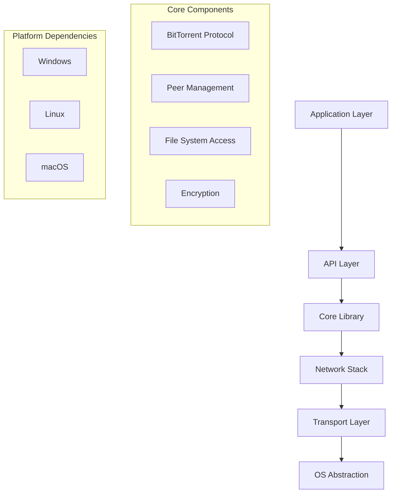
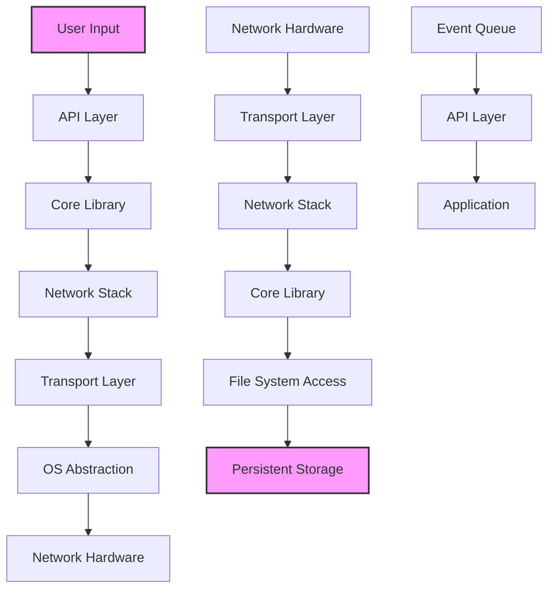
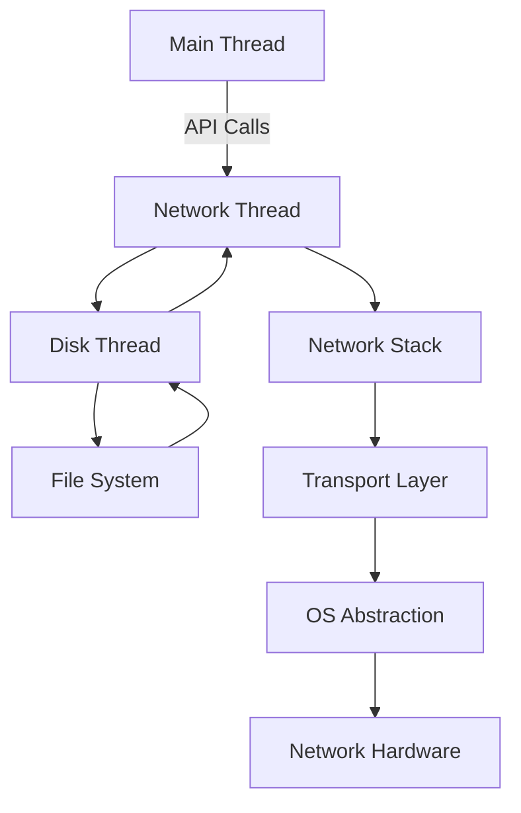

# libtorrent Architecture Documentation

## Architecture Overview

The libtorrent project follows a **monolithic, layered architecture** pattern, with a clear separation between core networking functionality, high-level API, and platform-specific abstractions. The design emphasizes **modularity within a unified codebase**, where core components are reusable across different platforms and bindings. Key design principles include **performance, portability, and extensibility**, with extensive use of C++ templates and RAII for resource management. The architecture prioritizes **network protocol fidelity** by maintaining a strict separation between the BitTorrent protocol implementation and higher-level application logic. Core architectural decisions include the use of **asynchronous I/O with boost::asio**, **event-driven design** for network operations, and **extensive use of smart pointers** for memory safety. The project also demonstrates strong **dependency management** through careful header organization and preprocessor directives for cross-platform compatibility.



## Component Breakdown

### 1. Core Library Component

**Purpose and Responsibilities**: 
The core library provides the fundamental BitTorrent protocol implementation, including peer connections, piece management, torrent metadata handling, and network communication. It serves as the foundation for all other components and bindings.

**Key Classes and Interfaces**:
- `torrent_handle`: Manages individual torrent sessions
- `session`: Coordinates multiple torrent sessions
- `peer_connection`: Handles peer communication
- `torrent`: Manages torrent-specific logic
- `alert`: Event notification system for various protocol events

**Interactions**:
- Interacts with **Network Stack** for TCP/UDP communication
- Communicates with **File System Access** for torrent data storage
- Receives configuration from **API Layer**
- Emits alerts to **Event System**

```cpp
// Example: Torrent handle interface
class torrent_handle {
public:
    void pause();
    void resume();
    status status() const;
    // ... other methods
};
```

### 2. API Layer Component

**Purpose and Responsibilities**:
Provides language-specific interfaces for the core library, enabling integration with different programming languages and applications. Includes Python and C bindings.

**Key Classes and Interfaces**:
- `libtorrent::add_torrent_params`: Configuration for adding torrents
- `libtorrent::alert`: Event notification system
- `libtorrent::create_torrent`: Torrent creation utility
- `libtorrent::session_params`: Session-wide configuration

**Interactions**:
- Wraps **Core Library** functionality
- Communicates with **Bindings** for language-specific integration
- Provides **configuration** to **Core Library**

```cpp
// Example: Adding a torrent
add_torrent_params params;
params.torrent_file = std::make_shared<torrent_info>(file_path);
session.add_torrent(params);
```

### 3. Network Stack Component

**Purpose and Responsibilities**:
Handles low-level network communication, including TCP/UDP sockets, protocol framing, and peer discovery. Implements the BitTorrent protocol over various transport mechanisms.

**Key Classes and Interfaces**:
- `tcp_connection`: TCP connection management
- `udp_socket`: UDP socket operations
- `peer_connection`: Peer communication handler
- `tracker_connection`: Tracker communication

**Interactions**:
- Communicates with **Transport Layer** for socket operations
- Interfaces with **Core Library** for protocol implementation
- Sends data to **File System Access** for storage

```cpp
// Example: TCP connection handling
class tcp_connection : public socket_manager {
public:
    void write(const char* data, std::size_t length);
    void on_data_available();
    void close();
};
```

### 4. File System Access Component

**Purpose and Responsibilities**:
Manages file operations for torrents, including piece storage, file creation, and I/O operations. Provides efficient data persistence and integrity verification.

**Key Classes and Interfaces**:
- `file_storage`: Manages torrent file layout
- `disk_io_thread`: Asynchronous disk I/O operations
- `piece_manager`: Coordinates piece storage and verification
- `storage_interface`: Abstract file storage operations

**Interactions**:
- Receives data from **Network Stack**
- Stores data in **Persistent Storage**
- Provides data to **Core Library** for verification

```cpp
// Example: Piece manager interface
class piece_manager : public storage_interface {
public:
    void write_piece(const piece_index& idx, const char* data);
    void read_piece(const piece_index& idx, char* data);
    bool verify_piece(const piece_index& idx);
};
```

## Data Flow



The data flow in libtorrent follows a **request-response pattern** with multiple transformation points:

1. **Application Layer** receives user input and creates requests through the API
2. **API Layer** validates and converts requests into core library operations
3. **Core Library** processes requests and interacts with the network stack
4. **Network Stack** handles protocol-specific framing and transmission
5. **Transport Layer** manages low-level socket operations
6. **OS Abstraction** provides platform-specific implementations
7. **Network Hardware** transmits data over the network
8. **Return Path** follows the reverse route with responses and events

**Key Data Structures**:
- `torrent_info`: Contains metadata about a torrent
- `piece_index`: Identifies specific pieces in a torrent
- `peer_info`: Stores information about connected peers
- `alert`: Contains protocol events and notifications
- `file_storage`: Maps files to piece ranges

**Data Transformation Points**:
1. **API Layer**: Converts language-specific types to core library types
2. **Network Stack**: Transforms raw data into protocol messages
3. **File System Access**: Converts file data into piece format
4. **Core Library**: Verifies data integrity and handles piece assembly

## Design Patterns

### 1. Observer Pattern

**Implementation**:
```cpp
// Alert system implementation
class alert {
public:
    virtual ~alert() = default;
    virtual alert_type type() const = 0;
};

class session {
public:
    void add_alert(std::unique_ptr<alert> a);
    std::vector<alert> pop_alerts();
private:
    std::vector<std::unique_ptr<alert>> alerts_;
};

// Usage
class my_alert_listener : public alert_listener {
public:
    void on_alert(std::unique_ptr<alert> a) override {
        if (a->type() == alert::torrent_finished_alert) {
            // Handle finished torrent
        }
    }
};
```

**Application**: The alert system uses the Observer pattern, where the `session` acts as the subject and various components act as observers. This enables **event-driven architecture** and decouples notification from business logic.

### 2. Factory Pattern

**Implementation**:
```cpp
// Torrent creation factory
class create_torrent {
public:
    static std::unique_ptr<create_torrent> create(
        std::vector<std::string> files,
        int piece_size = 16 * 1024);
    
    std::vector<char> generate() const;
private:
    std::vector<file_entry> files_;
    int piece_size_;
};

// Usage
auto torrent = create_torrent::create({"file1.txt", "file2.txt"});
auto torrent_data = torrent->generate();
```

**Application**: Used extensively for creating complex objects like torrents, where the construction process involves multiple steps and configuration options. This pattern provides **encapsulation of object creation** and allows for easy extension of torrent creation capabilities.

### 3. Singleton Pattern

**Implementation**:
```cpp
// Session singleton
class session {
public:
    static session& instance();
    void add_torrent(add_torrent_params const& p);
    void pause();
    void resume();
    
private:
    session();
    static std::unique_ptr<session> instance_;
};

session& session::instance() {
    if (!instance_) {
        instance_ = std::make_unique<session>();
    }
    return *instance_;
}
```

**Application**: The `session` class acts as a singleton, providing a single global point of access to the torrent library's core functionality. This pattern simplifies API usage and ensures consistent state management across the application.

### 4. Strategy Pattern

**Implementation**:
```cpp
// Encryption strategy
class encryption_algorithm {
public:
    virtual ~encryption_algorithm() = default;
    virtual std::vector<char> encrypt(const std::vector<char>& data) = 0;
    virtual std::vector<char> decrypt(const std::vector<char>& data) = 0;
};

class aes_encryption : public encryption_algorithm {
public:
    std::vector<char> encrypt(const std::vector<char>& data) override;
    std::vector<char> decrypt(const std::vector<char>& data) override;
};

class session {
public:
    void set_encryption(std::unique_ptr<encryption_algorithm> algo);
private:
    std::unique_ptr<encryption_algorithm> encryption_;
};
```

**Application**: Used for encryption methods, allowing runtime selection of different encryption algorithms. This pattern enables **flexible configuration** and supports multiple security protocols without modifying core code.

## Threading and Concurrency

### Threading Model

libtorrent employs a **multi-threaded, event-driven architecture** with a clear separation of concerns:

1. **Main Thread**: Handles application logic and API calls
2. **Network Thread**: Manages all network I/O operations
3. **Disk Thread**: Handles file system operations
4. **I/O Thread**: Processes incoming data and manages connections



### Synchronization Mechanisms

**Key Synchronization Components**:

1. **Mutexes**:
```cpp
std::mutex session_mutex_;
std::lock_guard<std::mutex> guard(session_mutex_);
```

2. **Condition Variables**:
```cpp
std::condition_variable cv_;
cv_.notify_all();
cv_.wait(lock);
```

3. **Atomic Operations**:
```cpp
std::atomic<bool> running_{true};
if (running_.load(std::memory_order_acquire)) { ... }
```

4. **Spinlocks**:
```cpp
std::atomic_flag flag = ATOMIC_FLAG_INIT;
while (flag.test_and_set(std::memory_order_acquire)) { /* spin */ }
```

### Concurrent Data Structures

**Key Concurrent Structures**:

1. **Thread-Safe Queue**:
```cpp
template<typename T>
class thread_safe_queue {
public:
    void push(T const& data);
    bool try_pop(T& data);
    bool empty() const;
private:
    std::queue<T> queue_;
    mutable std::mutex mutex_;
    std::condition_variable data_cond_;
};
```

2. **Concurrent Hash Table**:
```cpp
template<typename Key, typename Value>
class concurrent_hash_map {
public:
    void insert(const Key& key, const Value& value);
    bool find(const Key& key, Value& value) const;
    size_t size() const;
private:
    std::unordered_map<Key, Value> map_;
    mutable std::shared_mutex mutex_;
};
```

3. **Thread-Safe Reference Counted Pointers**:
```cpp
template<typename T>
class thread_safe_ptr {
public:
    thread_safe_ptr(T* ptr);
    ~thread_safe_ptr();
    T* get() const;
    void reset();
private:
    T* ptr_;
    mutable std::atomic<int> ref_count_;
};
```

### Concurrency Patterns

**Main Concurrency Patterns**:

1. **Producer-Consumer**: Network thread produces data, disk thread consumes it
2. **Reader-Writer**: Multiple readers, single writer for shared resources
3. **Task Queue**: Work items are queued and processed by worker threads
4. **Double Buffering**: Prevents race conditions in data processing

The architecture uses **fine-grained locking** to minimize contention and ensure high performance under concurrent access. All critical sections are protected by appropriate synchronization mechanisms, with careful attention to avoiding deadlocks and priority inversion.