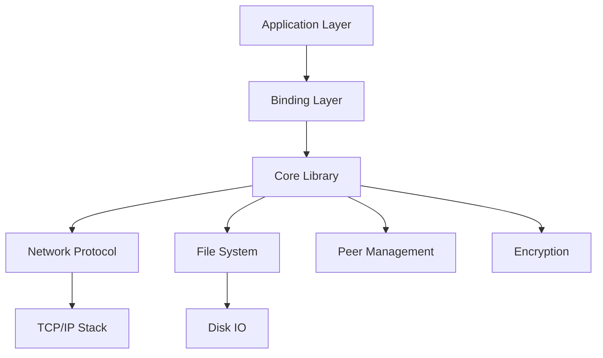
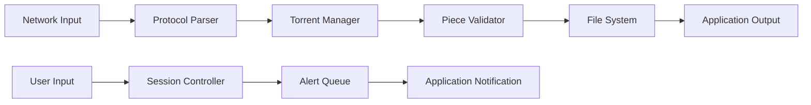
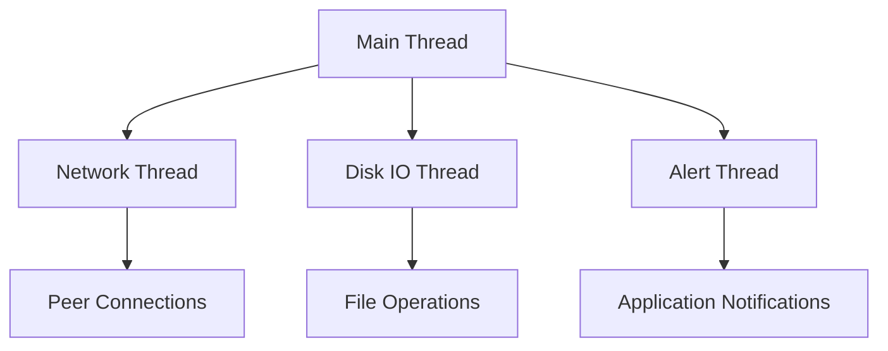

# libtorrent Architecture Documentation

## 1. Architecture Overview

The libtorrent project follows a **layered architectural pattern** with a strong emphasis on modularity and separation of concerns. The system is structured as a monolithic library that provides comprehensive BitTorrent functionality while maintaining clear boundaries between components. Key design principles include performance optimization, thread safety, and extensibility through well-defined interfaces.

The architecture prioritizes **network protocol implementation** at its core, with higher-level abstractions for user interaction and application integration. The use of C++ templates, smart pointers, and RAII ensures memory safety and efficient resource management. Key architectural decisions include the separation of network I/O from business logic, a robust alert system for asynchronous notifications, and extensive use of Boost libraries for cross-platform compatibility.

The project's modular design allows for both direct integration into applications and binding to higher-level languages like Python through dedicated bindings modules. This layered approach enables developers to leverage specific components without requiring knowledge of the entire codebase, while maintaining performance-critical optimizations throughout the system.



## 2. Component Breakdown

### Core Library (libtorrent)

**Purpose**: The central component providing BitTorrent protocol implementation, peer management, and file handling.

**Key Classes & Interfaces**:
- `session`: Manages the overall torrent session
- `torrent_handle`: Represents a single torrent
- `alert`: Base class for all notifications
- `add_torrent_params`: Configuration parameters for adding torrents

```cpp
class session {
public:
    void add_torrent(add_torrent_params const& params);
    std::vector<alert> wait_for_alert(time_duration timeout);
};
```

**Interactions**: 
- Communicates with network layer via TCP/IP stack
- Interacts with file system through disk IO operations
- Sends alerts to application layer for notification

### Network Layer

**Purpose**: Handles all network communication, including peer connections and protocol messaging.

**Key Classes & Interfaces**:
- `peer_connection`: Manages individual peer connections
- `tcp_socket`: Abstracts TCP socket operations
- `bittorrent_protocol`: Implements BitTorrent protocol messages

```cpp
class peer_connection : public tcp_socket {
public:
    void on_piece(piece_index_t index);
    void send_request(request const& req);
};
```

**Interactions**: 
- Receives data from physical network layer
- Sends/receives data to/from peers
- Communicates with core library for torrent metadata

### File System Layer

**Purpose**: Manages file storage, reading, and writing operations.

**Key Classes & Interfaces**:
- `disk_io_thread`: Handles all disk I/O operations
- `file_storage`: Represents the structure of files in a torrent
- `piece_manager`: Tracks piece availability and integrity

```cpp
class disk_io_thread {
public:
    void async_read(piece_index_t index, std::vector<char>& buffer);
    void async_write(piece_index_t index, char const* data);
};
```

**Interactions**: 
- Receives read/write requests from core library
- Communicates with operating system through file system APIs
- Provides integrity verification for downloaded pieces

### Binding Layer (Python/C)

**Purpose**: Enables integration with higher-level languages.

**Key Classes & Interfaces**:
- `boost_python.hpp`: Python binding interface
- `library.cpp`: C API implementation
- `bytes.hpp`: Data type conversion utilities

```cpp
BOOST_PYTHON_MODULE(libtorrent) {
    class_<session>("session")
        .def("add_torrent", &session::add_torrent)
        .def("wait_for_alert", &session::wait_for_alert);
}
```

**Interactions**: 
- Exposes core library functionality to external applications
- Handles data type conversions between C++ and target languages
- Provides error handling across language boundaries

## 3. Data Flow

The data flow in libtorrent follows a clear pattern from network input to application output:



**Key Data Structures**:
- `torrent_info`: Contains metadata about a torrent
- `piece_block`: Represents a block of data to be transferred
- `peer_connection`: Tracks connection state and statistics

**Data Transformation Points**:
1. **Network Layer**: Raw bytes from network → structured protocol messages
2. **Protocol Parser**: Protocol messages → internal data structures
3. **Piece Validator**: Downloaded pieces → verified content
4. **File System**: Verified content → persistent storage

```cpp
struct piece_block {
    piece_index_t index;
    std::vector<char> data;
    bool is_verified;
};
```

## 4. Design Patterns

### Observer Pattern

**Application**: Implemented through the alert system.

**Implementation**:
- `alert`: Base class for all notifications
- `session`: Maintains an alert queue and notifies subscribers
- `alert_manager`: Handles alert dispatching

```cpp
class session {
    std::vector<alert> m_alerts;
public:
    void wait_for_alert() {
        // Process alerts when available
        for (auto& a : m_alerts) {
            if (a.type() == alert::torrent_finished) {
                // Notify interested parties
            }
        }
    }
};
```

### Factory Pattern

**Application**: Used in torrent creation and session management.

**Implementation**:
- `add_torrent_params`: Configuration factory for torrents
- `session_params`: Configuration factory for sessions

```cpp
class add_torrent_params {
public:
    static add_torrent_params create_from_torrent_file(std::string const& path);
    static add_torrent_params create_from_magnet_uri(std::string const& uri);
};
```

### Singleton Pattern

**Application**: Session management.

**Implementation**:
- `session`: Ensures only one instance exists per application
- Thread-safe initialization using double-checked locking

```cpp
class session {
private:
    static std::unique_ptr<session> m_instance;
public:
    static session& get() {
        if (!m_instance) {
            std::lock_guard<std::mutex> lock(m_mutex);
            if (!m_instance)
                m_instance = std::make_unique<session>();
        }
        return *m_instance;
    }
};
```

### Strategy Pattern

**Application**: Encryption and compression algorithms.

**Implementation**:
- `encryption`: Base class for encryption strategies
- `plain_encryption`, `rc4_encryption`: Concrete implementations

```cpp
class encryption {
public:
    virtual void encrypt(char* data, int size) = 0;
};

class rc4_encryption : public encryption {
public:
    void encrypt(char* data, int size) override { /* RC4 implementation */ }
};
```

## 5. Threading and Concurrency

### Threading Model

libtorrent employs a **multi-threaded architecture** with distinct thread pools:



### Synchronization Mechanisms

**Key Components**:
- `mutex`: For protecting shared resources
- `condition_variable`: For thread coordination
- `atomic`: For lock-free operations

```cpp
class session {
    std::mutex m_mutex;
    std::condition_variable m_alert_condition;
    std::vector<alert> m_alerts;
    
public:
    void wait_for_alert() {
        std::unique_lock<std::mutex> lock(m_mutex);
        m_alert_condition.wait(lock, [this] { return !m_alerts.empty(); });
    }
};
```

### Concurrent Data Structures

**Key Structures**:
- `thread_safe_queue`: Thread-safe queue for alerts
- `shared_ptr`: Reference-counted objects across threads
- `atomic_counter`: For thread-safe counters

```cpp
template<typename T>
class thread_safe_queue {
private:
    std::queue<T> m_queue;
    mutable std::mutex m_mutex;
    
public:
    void push(T const& item) {
        std::lock_guard<std::mutex> lock(m_mutex);
        m_queue.push(item);
    }
    
    bool try_pop(T& result) {
        std::lock_guard<std::mutex> lock(m_mutex);
        if (m_queue.empty()) return false;
        result = std::move(m_queue.front());
        m_queue.pop();
        return true;
    }
};
```

### Thread Safety

The architecture ensures thread safety through:
1. **Immutable data structures** where possible
2. **Fine-grained locking** to minimize contention
3. **Thread-local storage** for non-shared state
4. **Message passing** between threads instead of shared memory

This design enables high performance while maintaining correctness in concurrent operations, making libtorrent suitable for both single-threaded applications and complex multi-threaded systems.