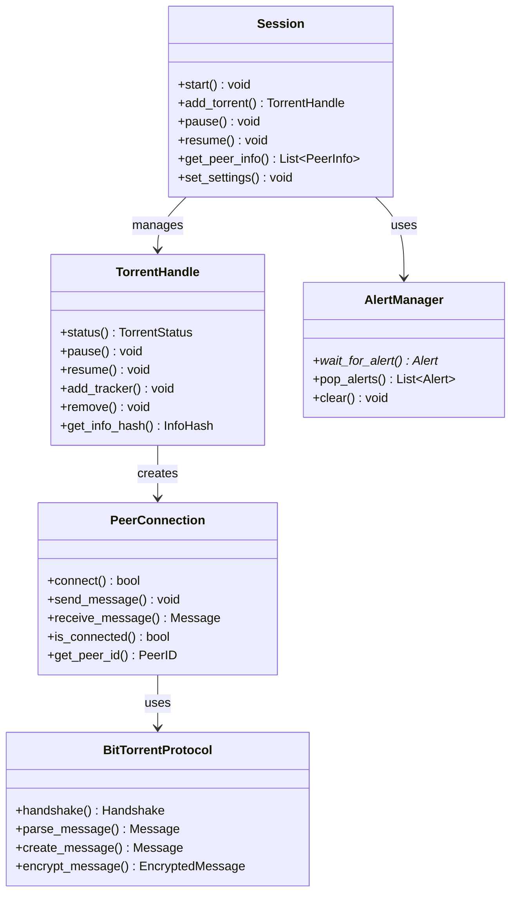
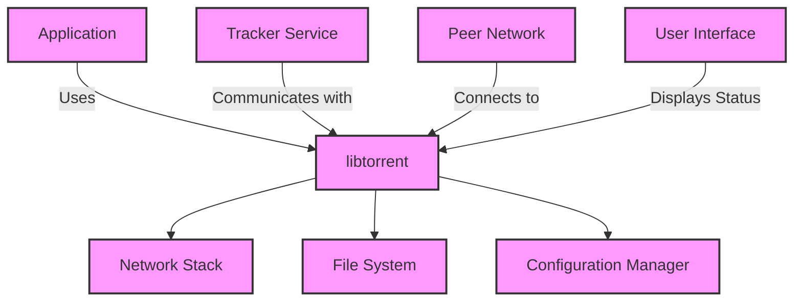
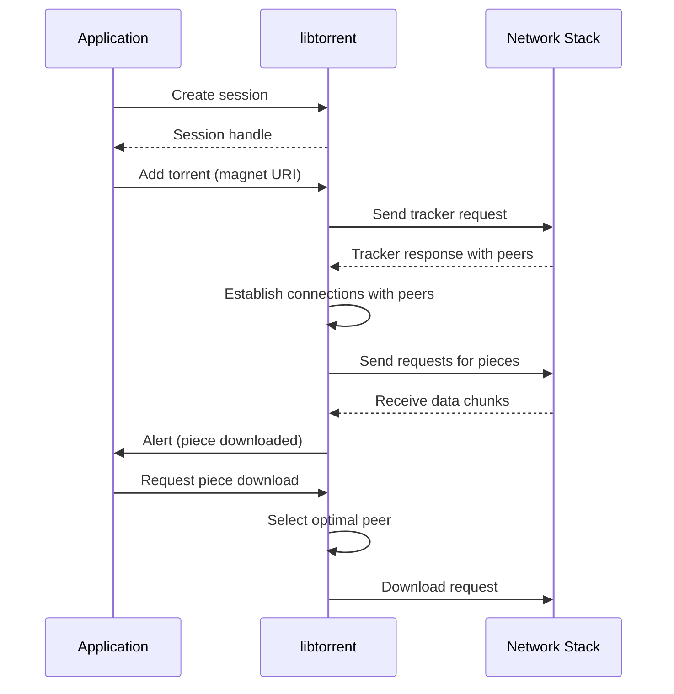

# libtorrent Module Documentation

## 1. Overview

The `libtorrent` module provides a comprehensive C++ library for implementing BitTorrent protocol clients and trackers. It enables applications to download, upload, and manage torrent files while handling complex networking operations such as peer discovery, piece selection, encryption, and bandwidth management. This module solves the challenge of building robust P2P file sharing functionality without requiring developers to implement low-level network protocols from scratch.

The library is designed for integration into larger applications that need BitTorrent capabilities, providing a high-performance foundation for torrent clients. It fits centrally in the system architecture as the core networking component responsible for actual data transfer and peer communication, serving as the backbone for any application requiring P2P file sharing functionality.

## 2. Main Classes and Responsibilities



### Session
- **Brief Description**: Manages the overall torrent client state and coordinates multiple torrents.
- **Primary Responsibilities**: 
  - Maintains global settings and network configuration
  - Handles peer connections and tracker communication
  - Manages alerts and notifications
  - Coordinates resource allocation across all active torrents
- **Key Methods**: `start()`, `add_torrent()`, `pause()`, `resume()`, `get_peer_info()`, `set_settings()`
- **Relationships**: 
  - Composes `TorrentHandle` instances
  - Uses `AlertManager` for event notification
  - Interacts with network components

### TorrentHandle
- **Brief Description**: Represents a single torrent being downloaded or uploaded.
- **Primary Responsibilities**:
  - Tracks download/upload progress and status
  - Manages piece selection and file operations
  - Handles peer connections specific to this torrent
  - Reports statistics to the session
- **Key Methods**: `status()`, `pause()`, `resume()`, `add_tracker()`, `remove()`, `get_info_hash()`
- **Relationships**:
  - Created by `Session`
  - Manages `PeerConnection` instances
  - Communicates with `BitTorrentProtocol`

### AlertManager
- **Brief Description**: Centralized system for handling asynchronous events and notifications.
- **Primary Responsibilities**:
  - Collects and queues alerts from various subsystems
  - Provides a unified interface for event processing
  - Manages alert lifecycle and memory management
- **Key Methods**: `wait_for_alert()`, `pop_alerts()`, `clear()`
- **Relationships**:
  - Used by all major components to report events
  - Integrates with the main application loop

### PeerConnection
- **Brief Description**: Manages individual peer connections for data transfer.
- **Primary Responsibilities**:
  - Establishes and maintains TCP/UDP connections
  - Handles message exchange with peers
  - Implements connection security features
  - Tracks connection quality and performance
- **Key Methods**: `connect()`, `send_message()`, `receive_message()`, `is_connected()`, `get_peer_id()`
- **Relationships**:
  - Created by `TorrentHandle`
  - Uses `BitTorrentProtocol` for message formatting

### BitTorrentProtocol
- **Brief Description**: Implements the core BitTorrent protocol specifications.
- **Primary Responsibilities**:
  - Handles handshake and protocol negotiation
  - Formats and parses messages according to BitTorrent standards
  - Manages encryption and obfuscation techniques
  - Ensures compatibility with various clients
- **Key Methods**: `handshake()`, `parse_message()`, `create_message()`, `encrypt_message()`
- **Relationships**:
  - Used by `PeerConnection` for message processing

## 3. Module Interactions



### Dependencies

**External Dependencies**:
- Network Stack (for TCP/UDP communication)
- File System (for torrent file storage and piece management)
- Configuration Manager (for settings persistence)
- Tracker Service (for peer discovery)
- Peer Network (for actual data transfer)

**Internal Dependencies**:
- `libtorrent` depends on its own internal components as shown in the class diagram
- The module exposes a C API through `bindings/c/libtorrent.h` for external consumption

### Key Interfaces Exposed

1. **C API Interface**: 
   - `libtorrent.h` provides functions like `lt_session_create()`, `lt_torrent_add()`, and `lt_alert_wait_for()`
   - Allows integration with non-C++ applications
   - Provides thread-safe operations for multi-threaded environments

2. **Python Bindings**:
   - Exposes high-level interfaces through the Python module
   - Enables rapid development and prototyping
   - Supports asynchronous event handling via callbacks

3. **Alert System**:
   - Standardized notification system for all events (download complete, peer connected, etc.)
   - Allows applications to respond to various states without polling

### Data Flow



## 4. Typical Usage Scenarios

### Scenario 1: Basic Torrent Download
```cpp
#include "libtorrent.h"

int main() {
    // Create session with default settings
    lt_session* session = lt_session_create();
    
    // Add torrent using magnet URI
    lt_torrent_handle* handle = lt_add_magnet_uri(session, 
        "magnet:?xt=urn:btih:1234567890abcdef...");
    
    // Start download process
    lt_start_download(handle);
    
    // Wait for completion with periodic status checks
    while (!lt_is_complete(handle)) {
        lt_alert* alert = lt_wait_for_alert(session, 1000); // 1 second timeout
        if (alert) {
            printf("Alert: %s\n", lt_alert_message(alert));
            lt_clear_alert(alert);
        }
    }
    
    // Clean up resources
    lt_session_destroy(session);
    return 0;
}
```

### Scenario 2: Advanced Configuration with Custom Settings

```python
import libtorrent as lt

# Create session with custom settings
settings = {
    'listen_port': 6881,
    'upload_rate_limit': 500,  # KB/s
    'download_rate_limit': 1000,
    'max_connections': 200,
    'enable_dht': True,
    'enable_lsd': False
}

session = lt.session(settings)

# Add torrent with specific options
torrent_info = lt.torrent_info('path/to/torrent/file.torrent')
add_torrent_params = {
    'ti': torrent_info,
    'save_path': '/downloads/',
    'storage_mode': lt.storage_mode_t.storage_mode_sparse
}

handle = session.add_torrent(add_torrent_params)

# Monitor download progress
while not handle.is_finished():
    print(f"Progress: {handle.status().progress * 100:.2f}%")
    
    # Check for alerts
    alerts = session.pop_alerts()
    for alert in alerts:
        if isinstance(alert, lt.torrent_finished_alert):
            print("Download complete!")
            
    time.sleep(1)

session.pause()
```

### Scenario 3: Real-time Monitoring Application

```cpp
// Initialize session with event monitoring enabled
lt_session* session = lt_session_create();
lt_alert_manager* alerts = lt_get_alerts(session);

while (true) {
    // Wait for events with timeout
    lt_alert* alert = lt_wait_for_alert(session, 500);
    
    if (alert) {
        switch (alert->type()) {
            case LT_ALERT_TYPE_TORRENT_FINISHED:
                printf("Torrent finished downloading\n");
                break;
                
            case LT_ALERT_TYPE_PEER_CONNECTED:
                printf("Peer connected: %s\n", 
                       lt_get_peer_address(alert));
                break;
                
            case LT_ALERT_TYPE_DOWNLOAD_PROGRESS:
                printf("Download progress: %.2f%%\n",
                      alert->progress() * 100);
                break;
        }
        
        lt_clear_alert(alert);
    }
    
    // Periodic status update
    if (lt_is_time_to_update()) {
        lt_update_status(session);
    }
}
```

## 5. Design Patterns and Principles

### Key Design Patterns Used

1. **Observer Pattern**:
   - Implemented through the alert system where components register for specific events
   - Allows decoupled communication between subsystems
   - Enables asynchronous event handling without tight coupling

2. **Factory Pattern**:
   - `lt_session_create()` and similar functions create instances with proper initialization
   - Ensures consistent object construction across different platforms
   - Provides a clean interface for creating complex objects

3. **Singleton Pattern** (for session):
   - The session acts as a central coordinator that manages all torrent operations
   - Ensures global access to the torrent client state
   - Simplifies resource management and configuration

4. **Bridge Pattern**:
   - Separates protocol implementation from network transport
   - Allows different networking backends while maintaining consistent API
   - Facilitates future extensions with new protocols or transports

### Key Architectural Decisions

1. **Layered Architecture**: 
   - Clear separation between application logic, core protocol, and network layers
   - Each layer has well-defined responsibilities and interfaces
   - Enables independent development and testing of components

2. **Event-Driven Design**:
   - All state changes are communicated through alerts rather than direct callbacks
   - Reduces complexity in the main loop by decoupling event processing from application logic
   - Supports asynchronous operations without blocking execution

3. **Resource Pooling**:
   - Connection and memory pools for efficient resource management
   - Prevents performance degradation under high load conditions
   - Optimizes system resources through reuse of allocated components

### Why This Approach Was Chosen

The architecture was designed to balance performance, maintainability, and extensibility:

1. **Performance**: The layered approach with connection pooling ensures optimal network utilization while minimizing overhead.

2. **Maintainability**: Clear separation of concerns makes the codebase easier to understand, test, and modify.

3. **Extensibility**: The modular design allows for easy addition of new features like protocol extensions or alternative transport mechanisms.

4. **Cross-platform Compatibility**: By abstracting network operations and using standardized interfaces, the library can run on various operating systems with minimal changes.

5. **Security**: The separation between protocol implementation and networking provides a foundation for implementing security measures at different levels of the stack.