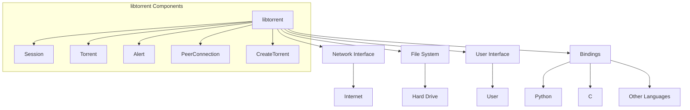

# libtorrent Module Documentation

## 1. Overview

The `libtorrent` module provides a comprehensive C++ library for implementing BitTorrent protocol functionality. It enables applications to download, upload, and manage torrent files and magnet links, supporting both peer-to-peer file sharing and streaming capabilities. The module solves the need for a robust, cross-platform BitTorrent implementation that can be integrated into various applications, from media players to file sharing utilities. Within the overall system, `libtorrent` serves as the core networking component responsible for handling torrent operations, connecting to peers, managing file transfers, and reporting progress and errors. It offers bindings for multiple programming languages including C and Python, making it accessible to a wide range of developers and applications. The module handles complex networking tasks such as peer discovery, encryption, bandwidth management, and protocol negotiation, abstracting these details from client applications.

## 2. Main Classes and Responsibilities

### Session
- **Description**: Manages the overall torrent session, coordinating all torrent operations and network activity
- **Responsibilities**: 
  - Creates and manages torrent handles
  - Manages network connections and port configuration
  - Handles peer connections and communication
  - Processes alerts and events
- **Key Methods**: `add_torrent()`, `pause()`, `resume()`, `stop()`, `get_torrents()`, `alert_queue()`
- **Relationships**: Composes `torrent` objects, uses `peer_connection` and `network_interface`, receives alerts from all components

### Torrent
- **Description**: Represents a single torrent download or upload, managing file operations and peer communication
- **Responsibilities**: 
  - Tracks download/upload progress for all files in the torrent
  - Manages piece selection and peer connections
  - Handles file I/O operations
  - Reports status and progress
- **Key Methods**: `status()`, `resume()`, `pause()`, `set_priority()`, `add_peer()`, `get_peer_info()`
- **Relationships**: Composed by `Session`, uses `file_storage`, `piece_picker`, and `peer_connection` components

### Alert
- **Description**: Represents notifications of events within the torrent system
- **Responsibilities**: 
  - Provides information about system events (connections, errors, progress)
  - Contains metadata about the event (type, timestamp, source)
  - Acts as a communication mechanism between components
- **Key Methods**: `type()`, `message()`, `torrent()`, `category()`, `timestamp()`
- **Relationships**: Generated by all components, collected by `Session`, processed by application code

### PeerConnection
- **Description**: Manages individual peer connections and protocol communication
- **Responsibilities**: 
  - Establishes and maintains TCP connections to peers
  - Implements BitTorrent protocol extensions
  - Handles encryption and protocol negotiation
  - Manages piece requests and responses
- **Key Methods**: `connect()`, `send_message()`, `receive_message()`, `close()`, `get_peer_info()`
- **Relationships**: Created by `Session`, used by `Torrent`, communicates with `NetworkInterface`

### CreateTorrent
- **Description**: Generates new torrent files from directory structures
- **Responsibilities**: 
  - Analyzes directory structure and file metadata
  - Creates torrent metadata with piece hashes
  - Generates torrent file format
  - Supports various torrent formats (v1, v2)
- **Key Methods**: `add_files()`, `set_comment()`, `set_tracker()`, `generate()`, `add_url_seed()`
- **Relationships**: Uses `file_storage`, `piece_picker`, and `sha1_hasher` components

## 3. Module Interactions



The `libtorrent` module depends on the following external components:
- **Network Interface**: For establishing and managing network connections
- **File System**: For reading and writing torrent files and downloaded content
- **Crypto Library**: For implementing encryption protocols
- **Thread Library**: For managing concurrent operations
- **Configuration System**: For handling user settings and preferences

Modules that depend on `libtorrent` include:
- **Media Player**: Uses libtorrent for streaming content from torrents
- **File Manager**: Integrates torrent functionality for file sharing
- **Download Manager**: Leverages libtorrent for peer-to-peer downloads
- **System Monitor**: Uses alerts to track system performance and status

Key interfaces exposed by this module:
- **C API**: Provides C-compatible functions for external applications
- **Python Bindings**: Enables Python integration
- **Alert System**: Provides event notifications to applications
- **Torrent Handle**: Allows application control over individual torrents

Data flows as follows:
1. **Outbound**: Configuration data flows from application → libtorrent
2. **Inbound**: Network data flows from internet → libtorrent → application
3. **Feedback**: Alerts and status updates flow from libtorrent → application
4. **Storage**: File data flows from libtorrent → file system

## 4. Typical Usage Scenarios

### Scenario 1: Creating and Starting a Torrent Download

Applications use `libtorrent` to download files from torrents or magnet links. This is common in media players and file managers that need to access content from peer networks.

```python
import libtorrent as lt

# Create a session
ses = lt.session()
ses.listen_on(6881, 6891)

# Add a torrent file
info = lt.torrent_info('example.torrent')
handle = ses.add_torrent({'ti': info, 'save_path': './downloads'})

# Monitor download progress
while not handle.is_seed():
    s = handle.status()
    print(f"Downloading {s.progress * 100:.2f}%")
    time.sleep(1)

print("Download complete!")
```

### Scenario 2: Creating a New Torrent

Applications use `libtorrent` to create torrent files for sharing their own content. This is used in file-sharing applications and content distribution systems.

```cpp
#include <libtorrent/torrent_creator.hpp>

// Create a new torrent with file metadata
lt::create_torrent t;
t.add_files("/path/to/files/", lt::create_torrent::no_progress_callback);

// Set torrent metadata
t.set_comment("My shared files");
t.set_priv(true); // private torrent
t.set_tracker("http://tracker.example.com");

// Generate torrent file
lt::entry e = t.generate();
std::ofstream out("my_torrent.torrent");
e.encode(out);
```

### Scenario 3: Building a BitTorrent Client

Applications integrate `libtorrent` to build complete BitTorrent clients with advanced features like bandwidth management, peer filtering, and encryption.

```cpp
// Initialize session with custom settings
lt::session ses(lt::session_params());

// Configure bandwidth limits
ses.set_settings({
    {"max_download_speed", 1000000},  // 1MB/s
    {"max_upload_speed", 500000},     // 500KB/s
    {"enable_dht", true}
});

// Add torrent with custom priorities
lt::torrent_handle handle = ses.add_torrent({
    .ti = std::make_shared<lt::torrent_info>("example.torrent"),
    .save_path = "./downloads/"
});

// Set file priorities for selective downloading
std::vector<int> priorities = {1, 0, 1}; // download only selected files
handle.set_file_priority(0, priorities);
```

## 5. Design Patterns and Principles

The `libtorrent` module implements several key design patterns and architectural principles:

**Observer Pattern**: Implemented through the alert system, where components emit notifications about events, and interested parties (application code) receive these alerts.

**Factory Pattern**: Used in creating torrent handles, peer connections, and other components through centralized creation methods.

**State Pattern**: Applied in torrent and peer connection states, allowing different behaviors based on the current state (downloading, seeding, paused, etc.).

**Strategy Pattern**: Implemented through pluggable components for encryption, peer discovery, and protocol extensions.

**Key Architectural Decisions**:
1. **Event-Driven Architecture**: The module uses an alert system for notifications, decoupling components and enabling efficient event processing.
2. **Component-Based Design**: Complex functionality is broken down into specialized components that can be tested and maintained independently.
3. **Thread Safety**: The architecture is designed to handle concurrent operations safely across multiple threads.
4. **Extensibility**: Components are designed with pluggable interfaces for adding new features like encryption protocols or tracker types.

This approach was chosen because:
- It provides a clear separation of concerns, making the codebase more maintainable
- The event-driven model allows for efficient handling of numerous concurrent connections
- The component-based design enables easy integration with different applications
- The architecture supports future extensions and protocol updates
- The design ensures thread safety for multi-threaded applications

The module follows the principle of **"separation of concerns"**, with distinct components for networking, file operations, protocol handling, and user interface communication. This modular approach allows developers to use only the parts they need while maintaining a consistent interface across different applications.